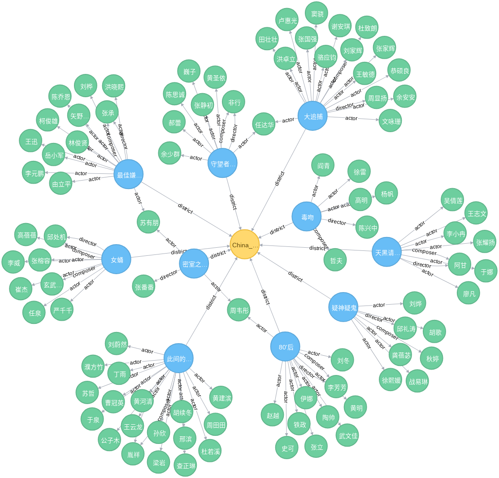
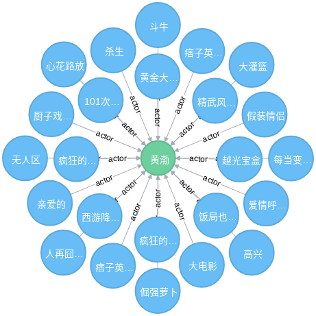
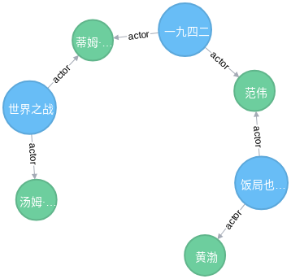

Knowledge Graph Examples
========================

## Douban Movie Graph

### Neo4j

Build graph

```shell
python cli.py import-to-neo4j --url bolt://localhost:7687/ \
                              --auth "neo4j:myneo4j" \
                              --data-dir movie/ \
                              --batch-size 1000 \
                              --drop-all
```


- Example 1:

  ```cypher
  match (c:Country)-[]-(m:Movie)-[]-(p:Person) return * limit 100
  ```

  Output:

  

- Example 2:

  ```cypher
  MATCH (m:Movie)-[r:actor]->(p:Person) WHERE p.name="黄渤" RETURN *
  ```

  Output

  

- Example 3:

  ```cypher
  MATCH (a:Person), (b:Person), p=shortestpath((a)-[:actor*]-(b))
  WHERE a.name="黄渤" and b.name="汤姆·克鲁斯"
  RETURN p
  ```
  Output

  
